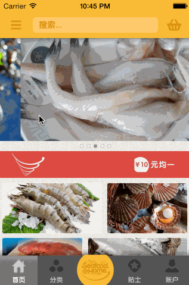
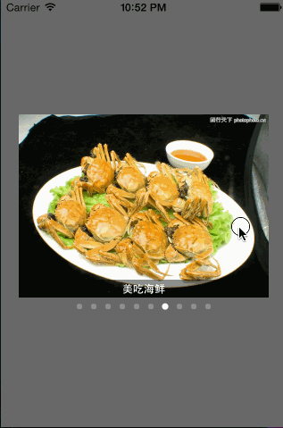

# BWMCoverView 

[](LICENSE.md) 
[](#)
[](#)
[](#cocoapods)


BWMCoverView is a very easy to use advertising the carousel view, supports circular scrolling functions such as switching, asynchronous loading of images, animation, custom is very high.

######ScreenShot
<table align="center">
    <tr>
        <td></td>
        <td></td>
    </tr>
</table>

## Requirements

* Xcode 6 or higher
* Apple LLVM compiler
* iOS 6.0 or higher
* ARC

## Demo

Build and run the `BWMCoverView.xcodeproj` project in Xcode.

## Installation

## CocoaPods

The recommended approach for installating `BWMCoverView` is via the [CocoaPods](http://cocoapods.org/) package manager, as it provides flexible dependency management and dead simple installation.
For best results, it is recommended that you install via CocoaPods >= **0.35.0** using Git >= **2.3.2** installed via Homebrew.

Install CocoaPods if not already available:

``` bash
$ [sudo] gem install cocoapods
$ pod setup
```

Change to the directory of your Xcode project:

``` bash
$ cd /path/to/MyProject
$ touch Podfile
$ edit Podfile
```

Edit your Podfile and add BWMCoverView:

``` bash
platform :ios, '7.0'
pod 'BWMCoverView', '~> 0.0.1'
```

Install into your Xcode project:

``` bash
$ pod install
```

Open your project in Xcode from the .xcworkspace file (not the usual project file)

``` bash
$ open MyProject.xcworkspace
```

Please note that if your installation fails, it may be because you are installing with a version of Git lower than CocoaPods is expecting. Please ensure that you are running Git >= **2.3.2** by executing `git --version`. You can get a full picture of the installation details by executing `pod install --verbose`.

### Manual Install

All you need to do is drop `BWMCoverView` files into your project, and add `#include "BWMCoverView.h"` to the top of classes that will use it.

## Usage

Usage is very simple, just need 3 steps.

> 1. Create array of `BWMCoverViewModel`
> 
> 2. Using `BWMCoverView` factory method `+ coverViewWithModels:andFrame:andPlaceholderImageNamed:andClickdCallBlock:` create the new `BWMCoverView`.
> 
> 3. Add `BWMCoverView` to view

### 1.Create array of `BWMCoverViewModel`

```objc
// 此数组用来保存BWMCoverViewModel
NSMutableArray *realArray = [[NSMutableArray alloc] init];

for (int i = 0; i<5; i++) {
    NSString *imageStr = [NSString stringWithFormat:@"http://www.iphone567.com/wp-content/uploads/2014/10/image0%d.jpg", i+1];
    NSString *imageTitle = [NSString stringWithFormat:@"第%d个小猫", i+1];
    BWMCoverViewModel *model = [[BWMCoverViewModel alloc] initWithImageURLString:imageStr imageTitle:imageTitle];
    [realArray addObject:model];
}

// 以上代码只为了构建一个包含BWMCoverViewModel的数组而已——realArray
```
### 2.Create `BWMCoverView` to the view.

Using `BWMCoverView` factory method `+ coverViewWithModels:andFrame:andPlaceholderImageNamed:andClickdCallBlock:` create the new `BWMCoverView`.

Parameters：
* `models`: Is an array containing the `BWMCoverViewModel`
* `placeholderImageNamed`: Local name of the placeholder image
* `andClickdCallBlock`: Click on the picture to the callback

```objc
BWMCoverView *coverView = [BWMCoverView coverViewWithModels:realArray andFrame:self.view.frame andPlaceholderImageNamed:BWMCoverViewDefaultImage andClickdCallBlock:^(NSInteger index) {
    NSLog(@"你点击了第%d个图片", index);
}];
```

### 3.Add the specified view

```objc
[self.view addSubview:coverView];
```

In fact, more than just 3 sentences to create a `BWMCoverView`, you can also read, more custom effects.

#### More create methods

Example：

```objc
// 你也可以试着调用init方法创建BWMCoverView
BWMCoverView *coverView2 = [[BWMCoverView alloc] initWithFrame:self.view.frame];
[self.view addSubview:coverView2];

coverView2.models = realArray;
coverView2.placeholderImageNamed = BWMCoverViewDefaultImage;
coverView2.animationOption = UIViewAnimationOptionTransitionCurlUp;

[coverView2 setCallBlock:^(NSInteger index) {
    NSLog(@"你点击了第%d个图片", index);
}];

[coverView2 setScrollViewCallBlock:^(NSInteger index) {
    NSLog(@"当前滚动到第%d个页面", index);
}];
```

### Customization options

#### Option 1: set the view every time scrolling callback methods

```objc
[coverView setScrollViewCallBlock:^(NSInteger index) {
    NSLog(@"当前滚动到第%d个页面", index);
}];
```

#### Option 2: set AutoPlay

```objc
[coverView setAutoPlayWithDelay:3.0]; 
```

Where '3.0' is the distance in seconds.

#### Optional 3: set the picture display mode.

```objc
coverView.imageViewsContentMode = UIViewContentModeScaleAspectFit;
```

This's `enum` `UIViewContentMode`

#### Option 4: stop/resume auto-play

```objc
[coverView stopAutoPlayWithBOOL:YES]; // 停止自动播放
[coverView stopAutoPlayWithBOOL:NO]; // 恢复自动播放
```

#### Optional 5: set the toggle animation

```objc
[coverView setAnimationOption:UIViewAnimationOptionTransitionCurlUp]; // 设置切换动画
```

#### Optional 6: set hidden `TitleLabel`

```objc
coverView.titleLabel.hidden = YES; //隐藏TitleLabel
```

##### There are members of the following UI:
> * coverView2.scrollView
> * coverView2.pageControl
> * coverView2.titleLabel

Please view the interfaces file `BWMCoverView.h`.

####  After modifying the attribute must call the updateView method

```objc
[coverView updateView]; //修改属性后必须调用updateView方法，更新视图
```

## LICENSE

`BWMCoverView` is available under the MIT license.

## Contact

If you have any questions or suggestions, contact me `QQ724849296` or call `+8615918550637`, please.
